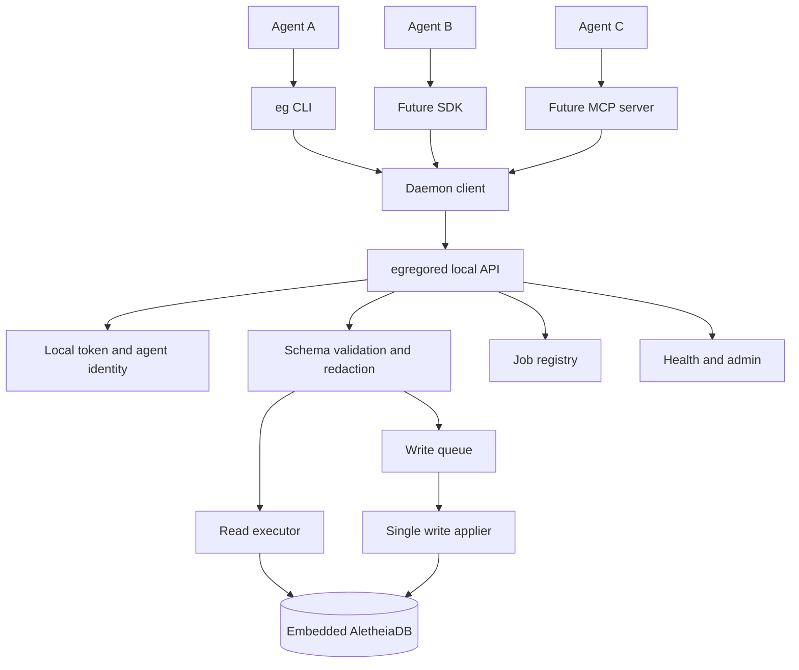

# Egregore Daemon Design

**Status:** Implemented v1 daemon slice on 2026-05-17; wire contract frozen in
[docs/schema/daemon-api.md](../schema/daemon-api.md); Windows runtime ACL
enforcement implemented 2026-06-08 (issue #56); remaining security and workflow
hardening planned.

**Goal:** Provide a safe local multi-agent access path to one AletheiaDB-backed
Egregore store without letting every agent open the embedded data directory as
its own process-local database owner.

**Wire contract:** The HTTP/JSON surface (`/v1/` routes, request envelope,
response envelope, error-code taxonomy, idempotency semantics) is specified in
[docs/schema/daemon-api.md](../schema/daemon-api.md). This design plan
describes *how* the daemon is built; the schema doc owns *what* it exposes.

**Runtime discovery contract:** The runtime sidecar layout, `egregored.json`
schema, stale-file detection, discovery walk, and file-permissions guarantees
are specified in [docs/schema/daemon-runtime.md](../schema/daemon-runtime.md).
The store-locking example below is non-normative; that schema doc is normative.

**Agent-action schema:** `ToolCall`, `FileEdit`, and `PatchArtifact` validation
rules, including artifact-domain placement and patch-status pinning, are
specified in [docs/schema/agent-actions.md](../schema/agent-actions.md).

**Semantic drift schema:** `SemanticDrift`, structured `embedding_model`,
semantic stable IDs, `DRIFTS_FROM`, `DRIFTS_PRIOR`, `MEASURED_BY`, and the
`drift_prior_target_mismatch` / `drift_record_immutable` daemon errors are
specified in [docs/schema/semantic-drift.md](../schema/semantic-drift.md).

**User-context schema:** preference-promotion candidates, prompts, decisions,
durable user policy records, and the approval-gates-policy invariant are
specified in [docs/schema/user-context.md](../schema/user-context.md).

**Redaction schema:** Agent-authored payload redaction markers and policy-version
metadata are specified in [docs/schema/redaction.md](../schema/redaction.md).

## Design Principles

- One process owns the embedded AletheiaDB handle for a data directory.
- Egregore, not AletheiaDB, owns agent workflow semantics.
- V1 `codegraph` writes pass through daemon envelope validation, idempotency,
  and graph-record parsing before persistence.
- Redaction, richer provenance edges, and non-codegraph workflow schemas are
  daemon responsibilities, but remain planned follow-up work.
- Reads may run concurrently through snapshot/read transactions.
- Writes are admitted through a bounded queue with durable success semantics.
- Embedded CLI access remains available for exclusive jobs and tests, but it
  must not silently bypass a running daemon.

## Architecture



`egregored` is a local-first service. It binds to loopback by default and stores
a random local access token in the daemon runtime directory. A future Unix
socket or Windows named pipe transport can be added after the HTTP/JSON contract
is stable, but the first implementation should use loopback HTTP because it is
easy to test from the CLI, MCP, and external tools.

The daemon owns:

- the embedded `AletheiaDB` handle
- the data-dir lease
- request identity and admission
- redaction and schema validation
- idempotency records
- write queue and write batching
- read/query execution limits
- job state for long-running ingestion
- health, metrics, and shutdown

The daemon does not own parsing. Repository scanning can stay in the CLI/library
and submit graph records to the daemon. This preserves the current clean
extractor-to-adapter boundary and avoids turning the daemon into a compiler
driver too early.

## Store Ownership and Locking

On startup, `egregored` acquires an exclusive advisory file lock in an adjacent
runtime sidecar directory. The precise path algorithm and file permissions are
normative in [docs/schema/daemon-runtime.md](../schema/daemon-runtime.md); this
example is illustrative:

```text
<data-dir>.egregore-runtime/egregored.lock
```

The runtime directory also stores daemon metadata and idempotency receipts. It
is adjacent to the `AletheiaDB` data directory rather than nested inside it so
daemon control files do not look like database files. Correctness comes from the
OS-level file lock, not from trusting the pid file. On Windows this should use a
real file locking primitive rather than a best-effort "create a file and hope"
ritual.

Embedded CLI writes must check the daemon lease. If a daemon owns the store, the
CLI should refuse direct embedded writes and tell the user to use the daemon
transport. A `--exclusive` or `--offline-repair` mode may bypass the daemon only
after acquiring the same lock and proving the daemon is not active.

This gives Egregore one rule: a data directory has one active embedded owner.
Everything else is a client.

**Repository identity and shared stores.** Every `Repository` node carries a structured `repository_identity` payload (see [docs/schema/repository-identity.md](../schema/repository-identity.md)) with one of three `identity_source` values: `remote`, `local_root_commit`, or `local_path`. The daemon write applier must reject ingest of any `Repository` node whose `identity_source` is `local_path` when the target data directory is a shared store (i.e., already contains more than one distinct `Repository` ID, or contains records from any non-`code_graph` domain). The rejection error code is `local_path_identity_unsupported`. Single-repo embedded stores remain permitted. Use `--repo-id-override` or a remote-backed clone for operator-controlled shared-store identity.

## Request Model

Every request carries a request envelope:

```json
{
  "request_id": "uuid",
  "agent_id": "codex:session-or-run-id",
  "session_id": "uuid-or-local-run-handle",
  "idempotency_key": "stable-key-for-retryable-writes",
  "domain": "codegraph|memory|task|artifact|verification",
  "created_at": "rfc3339",
  "payload": {}
}
```

For writes, `idempotency_key` is required. Retrying the same key must return the
original result if the write already committed. This handles the ugly but normal
case where the daemon commits successfully and the client dies before receiving
the response.

For reads, the daemon should support request budgets:

- maximum result count
- timeout
- query domain scope
- optional valid-time and transaction-time context

Large writes, such as history ingestion, should become jobs:

```text
POST /v1/jobs/ingest
GET  /v1/jobs/{job_id}
GET  /v1/jobs/{job_id}/events
```

Small writes can remain synchronous:

```text
POST /v1/records/ingest
POST /v1/observations       # candidate creation follows docs/schema/user-context.md
POST /v1/artifacts
POST /v1/verifications    # schema: docs/schema/verification.md
```

## Concurrency Model

Reads:

- Bounded by a semaphore.
- Use AletheiaDB read transactions or snapshot-safe query APIs.
- Must not hold daemon-global locks while executing graph traversal.
- Return a snapshot marker when useful so agents can reason about what view
  they saw.

Writes:

- Enter a bounded `tokio::mpsc` queue.
- Are applied by one write worker in commit order for v1.
- May batch adjacent graph-record ingestion requests when the domain and
  durability mode permit it.
- Respond only after the write is committed and required indexes are persisted
  or scheduled according to the selected durability mode.

This is intentionally conservative. AletheiaDB can support richer in-process
transaction concurrency, but the daemon should begin with one write applier
because agent writes are semantically rich and failure-prone. We can relax this
later with tests and metrics. Necromancy is cheaper when the corpse is small.

Backpressure:

- If the write queue is full, return `429` with `retry_after_ms`.
- If a job is too large for synchronous handling, return `202 Accepted` and a
  job id.
- If a request exceeds its budget, return a structured timeout error and record
  the failure as verification evidence only if the client explicitly asks.

## API Surface

Initial endpoints:

```text
GET  /v1/health
GET  /v1/status
POST /v1/agents/register
POST /v1/agents/heartbeat
POST /v1/records/ingest
GET  /v1/records/{record_id}
POST /v1/query
POST /v1/jobs/ingest
GET  /v1/jobs/{job_id}
GET  /v1/jobs/{job_id}/events
POST /v1/admin/checkpoint
POST /v1/admin/shutdown
```

Implemented v1 CLI mapping:

```text
eg daemon start --data-dir .egregore
eg daemon status
eg daemon stop
eg ingest graph.jsonl --adapter daemon --idempotency-key <key>
```

Implemented CLI mapping (daemon query surface):

```text
eg query symbol <name>  --daemon --data-dir .egregore
eg query file   <path>  --daemon --data-dir .egregore
eg query drift          --daemon --data-dir .egregore
```

The query verb spec is in [`docs/schema/daemon-query.md`](../schema/daemon-query.md).

Future CLI mapping:

```text
eg inspect --daemon ...
```

The existing `--adapter embedded` path remains, but it is for tests, one-off
exclusive imports, and offline maintenance. The shared default for multi-agent
work should be `--adapter daemon`.

## Agent Interaction

**Agent-memory schema:** [`docs/schema/agent-memory.md`](../schema/agent-memory.md)
specifies the record shapes (`Agent`, `AgentSession`, `Observation`, `Decision`,
`Failure`), required provenance fields, `EvidenceLink` type, and cross-domain
edge registry that agent writes must conform to. The write applier is the
enforcement point for `EvidenceLink` target validation.

Agents are not database clients. They are Egregore clients with explicit
identity and provenance.

Agent registration records:

- agent_id
- agent kind, such as `codex`, `claude-code`, `vantage`, or `human`
- project/repo scope
- session id
- started_at and last_seen_at
- optional parent run or task id

Writes from agents should create or connect provenance nodes:

- `Agent`
- `AgentSession`
- `Observation`
- `Task`
- `Artifact`
- `Verification`
- `CommandEvidence`

This makes "who wrote this fact, under which run, and with what proof" a graph
query instead of an archaeology expedition through terminal scrollback.

## Failure Modes

Daemon already running:

- Second daemon start for the same data dir fails with a clear error and the
  active daemon metadata.

Daemon crash during write:

- AletheiaDB WAL handles storage recovery.
- The daemon request journal and idempotency table allow clients to retry
  without duplicating semantic records.

Client crash after commit:

- Retry with the same idempotency key returns the original committed result.

Queue overload:

- The daemon rejects new writes with structured backpressure instead of letting
  clients pile up blocking processes.

Embedded bypass attempt:

- The CLI detects the active daemon lease and refuses direct embedded mutation
  unless an explicit offline-exclusive mode acquires the lease.

Schema or redaction failure:

- The daemon rejects before persistence. Rejection responses include field paths
  and stable error codes, not raw secret-bearing payload echoes.

## Verification Plan

Formal/spec boundary:

- State machine: `NoOwner -> DaemonOwner(data_dir) -> NoOwner`.
- Invariant: at most one embedded owner can hold the write lease for a data dir.
- Write queue invariant: accepted writes either commit once or return a durable
  rejection; committed idempotency keys resolve to one result.
- Redaction invariant: secret-classified fields do not enter persisted payloads.

Executable tests:

- Starting two daemons against the same temp data dir fails the second start.
- Embedded CLI write refuses while the daemon owns the data dir.
- Concurrent clients can issue reads while writes are queued.
- Concurrent client writes commit in daemon order and are readable afterward.
- Retrying a committed write with the same idempotency key returns the same
  record ids.
- A large ingest returns a job id and exposes progress.
- Daemon restart reopens the store and idempotency table.
- Auth token is required for local HTTP requests.

Manual smoke:

- `eg daemon start --data-dir <temp>`
- Run two clients ingesting separate JSONL files.
- Query cross-domain records from both clients.
- Stop daemon and reopen with embedded read-back to verify persistence.

## Implementation Slices

Implemented v1:

1. Daemon runtime config, lock acquisition, `eg daemon start/status/stop`, hidden
   foreground `eg daemon run`, and `/v1/health`.
2. Daemon client adapter and CLI `--adapter daemon`.
3. Bounded write queue, idempotency key handling, and synchronous graph-record
   ingestion.
4. Read-back and query endpoints with basic request budgets.
5. Agent/session registration plus `Agent`, `AgentSession`, and `SESSION_OF`
   graph records.
6. Job-backed ingest with status and event endpoints.

Still planned:

1. Full redaction policy enforcement for agent-authored non-codegraph payloads.
2. Dedicated observation, artifact, verification, and command-evidence write
   endpoints. `POST /v1/observations` owns user-context candidate creation per
   [docs/schema/user-context.md](../schema/user-context.md).
3. Explicit offline-exclusive repair mode that acquires the same lease.

Done:

- Structured logs, bounded counters, and retry-after fields on queue overload.
  `GET /v1/status` now exposes a machine-readable `pressure` block (idle / busy
  / saturated with bounded counters, transition timestamps, and a redacted
  event ring buffer), `eg daemon status` renders the state and retry guidance,
  and every `queue_full` rejection carries a positive `retry_after_ms`. The
  contract is frozen in
  [docs/schema/daemon-api.md § 10](../schema/daemon-api.md#10--write-admission-pressure).

## Open Questions

- Should v1 use loopback HTTP only, or add Windows named pipes immediately?
- Should idempotency metadata live as Egregore graph records, a small sidecar
  file, or both?
- How much of AletheiaDB's existing daemon should Egregore reuse as a storage
  transport once the Egregore API is stable?
- Should semantic embedding work run inside `egregored`, or in a separate worker
  that submits completed embedding records back through the daemon?
